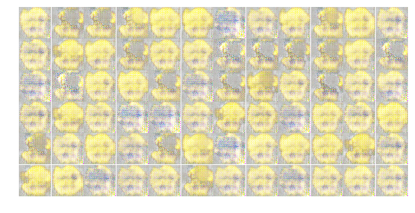

# deep emoji generative adversarial network

> (trying to) generate new emojis with DCGAN 🤗🏭

## development

keeping track of different network designs and hyperparameters

### [15817e6](https://github.com/anoff/deep-emoji-gan/blob/15817e6dc4c72496321b59b4fef99910d73292c2/Smiley_Generator.ipynb)

#### generator design

*convolutions:* `4`

*features:* `512 > 256 > 128 > 64 > 4`

*kernel size:* `5`

#### discriminator design

*convolutions:* `3`

*features:* `64 > 128 > 256`

*kernel size:* `5`

#### hyper params

*training set:* `225` (people no tones)

*epochs:* `768`

*learning rate:* `0.0002`

*batch size:* `64`

*opt.beta:* `0.4`

#### result

### [fa696d4](https://github.com/anoff/deep-emoji-gan/blob/fa696d4353342382dbeb31a793a82b6b6c3e1f7a/Smiley_Generator.ipynb)

#### generator design

*convolutions:* `4`

*features:* `256 > 128 > 32 > 4`

*kernel size:* `5`

#### discriminator design

*convolutions:* `3`

*features:* `32 > 128 > 256`

*kernel size:* `5`

#### hyper params

*training set:* `714` (people & activity)

*epochs:* `768`

*learning rate:* `0.0003`

*batch size:* `256`

*opt.beta:* `0.5`

#### result

### [e8285ca](https://github.com/anoff/deep-emoji-gan/blob/e8285cacd005ae8246a1eddc7123e70d2cdbfd1d/Smiley_Generator.ipynb)

#### generator design

*convolutions:* `4`

*features:* `256 > 128 > 32 > 4`

*kernel size:* `5`

#### discriminator design

*convolutions:* `3`

*features:* `32 > 128 > 256`

*kernel size:* `5`

#### hyper params

*training set:* `714` (people & activity)

*epochs:* `4096` (only `1200` run?)

*learning rate:* `0.0003`

*batch size:* `256`

*opt.beta:* `0.5`

#### result

### [151284d](https://github.com/anoff/deep-emoji-gan/blob/151284d577425c1537ea8dc4a0013aaa02ffe847/Smiley_Generator.ipynb)

#### generator design

*convolutions:* `3`

*features:* `64 > 32 > 16`

*kernel size:* `4 > 6 > 8`

#### discriminator design

*convolutions:* `3`

*features:* `8 > 16 > 32`

*kernel size:* `8 > 6 > 4`

#### hyper params

*training set:* `714` (people & activity)

*epochs:* `4096` (only `1200` run?)

*learning rate:* `0.0003`

*batch size:* `256`

*opt.beta:* `0.5`

#### result

### [9637353](https://github.com/anoff/deep-emoji-gan/blob/9637353a74d53c7ed22ecfd9aed4014b3b645a82/Smiley_Generator.ipynb)

#### generator design

*convolutions:* `4`

*features:* `1024 > 512 > 128 > 64`

*kernel size:* `3 > 5 > 5 > 7`

#### discriminator design

*convolutions:* `3`

*features:* `16 > 46 > 256`

*kernel size:* `5 > 4 > 3`

#### hyper params

*training set:* `714` (people & activity)

*epochs:* `1024`

*learning rate:* `0.0002`

*batch size:* `1289`

*opt.beta:* `0.5`

#### result

