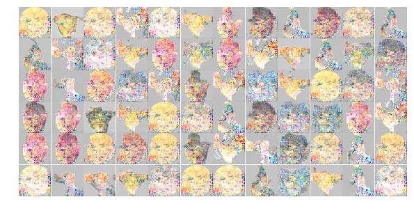
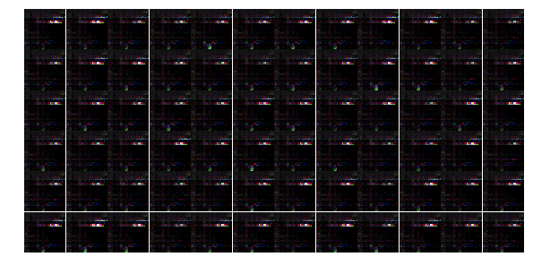
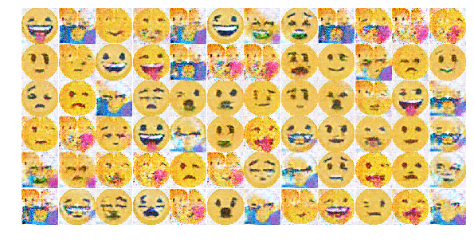

# deep emoji generative adversarial network

> (trying to) generate new emojis with DCGAN 🤗🏭

## usage

The emojis are taken from a git submodule to initialize it after cloning this repo run:

```sh
git submodule init
git submodule update
```

The code itself is currently hosted in a jupyter notebook so you may run `jupyter notebook` to access the latest version of the GAN and run all the cells to learn the network.

## development

keeping track of different network designs and hyperparameters

### [15817e6](https://github.com/anoff/deep-emoji-gan/blob/15817e6dc4c72496321b59b4fef99910d73292c2/Smiley_Generator.ipynb)

#### generator design

*convolutions:* `4`

*features:* `512 > 256 > 128 > 64 > 4`

*kernel size:* `5`

#### discriminator design

*convolutions:* `3`

*features:* `64 > 128 > 256`

*kernel size:* `5`

#### hyper params

*training set:* `225` (people no tones)

*epochs:* `768`

*learning rate:* `0.0002`

*batch size:* `64`

*opt.beta:* `0.4`

#### result


### [fa696d4](https://github.com/anoff/deep-emoji-gan/blob/fa696d4353342382dbeb31a793a82b6b6c3e1f7a/Smiley_Generator.ipynb)

#### generator design

*convolutions:* `4`

*features:* `256 > 128 > 32 > 4`

*kernel size:* `5`

#### discriminator design

*convolutions:* `3`

*features:* `32 > 128 > 256`

*kernel size:* `5`

#### hyper params

*training set:* `714` (people & activity)

*epochs:* `768`

*learning rate:* `0.0003`

*batch size:* `256`

*opt.beta:* `0.5`

#### result


### [e8285ca](https://github.com/anoff/deep-emoji-gan/blob/e8285cacd005ae8246a1eddc7123e70d2cdbfd1d/Smiley_Generator.ipynb)

#### generator design

*convolutions:* `4`

*features:* `256 > 128 > 32 > 4`

*kernel size:* `5`

#### discriminator design

*convolutions:* `3`

*features:* `32 > 128 > 256`

*kernel size:* `5`

#### hyper params

*training set:* `714` (people & activity)

*epochs:* `4096` (only `1200` run?)

*learning rate:* `0.0003`

*batch size:* `256`

*opt.beta:* `0.5`

#### result





### [151284d](https://github.com/anoff/deep-emoji-gan/blob/151284d577425c1537ea8dc4a0013aaa02ffe847/Smiley_Generator.ipynb)

#### generator design

*convolutions:* `3`

*features:* `64 > 32 > 16`

*kernel size:* `4 > 6 > 8`

#### discriminator design

*convolutions:* `3`

*features:* `8 > 16 > 32`

*kernel size:* `8 > 6 > 4`

#### hyper params

*training set:* `714` (people & activity)

*epochs:* `4096` (only `1200` run?)

*learning rate:* `0.0003`

*batch size:* `256`

*opt.beta:* `0.5`

#### result


### [9637353](https://github.com/anoff/deep-emoji-gan/blob/9637353a74d53c7ed22ecfd9aed4014b3b645a82/Smiley_Generator.ipynb)

#### generator design

*convolutions:* `4`

*features:* `1024 > 512 > 128 > 64`

*kernel size:* `3 > 5 > 5 > 7`

#### discriminator design

*convolutions:* `3`

*features:* `16 > 46 > 256`

*kernel size:* `5 > 4 > 3`

#### hyper params

*training set:* `714` (people & activity)

*epochs:* `1024`

*learning rate:* `0.0002`

*batch size:* `1289`

*opt.beta:* `0.5`

#### result


### [21b7da3](https://github.com/anoff/deep-emoji-gan/blob/21b7da31f964ae5d0817e47f47d02bfbc11ef113/Smiley_Generator.ipynb)

#### generator design

*convolutions:* `4`

*features:* `256 > 128 > 32 > 4`

*kernel size:* `5`

#### discriminator design

*convolutions:* `3`

*features:* `32 > 128 > 256`

*kernel size:* `5`

#### hyper params

*training set:* `1262` (no regionla, no symbols)

*epochs:* `1000`

*learning rate:* `0.0003`

*batch size:* `256`

*opt.beta:* `0.5`

#### result


### [0344c27](https://github.com/anoff/deep-emoji-gan/blob/0344c27ff4693ca052190f7866803ceee4f617ad/Smiley_Generator.ipynb)

#### generator design

*convolutions:* `4`

*features:* `256 > 128 > 32 > 4`

*kernel size:* `5`

#### discriminator design

*convolutions:* `3`

*features:* `32 > 128 > 256`

*kernel size:* `5`

#### hyper params

*training set:* `5063` (multi-set, no regionla, no symbols)

*epochs:* `1600`

*learning rate:* `0.0003`

*batch size:* `256`

*opt.beta1:* `0.4`

*opt.beta2:* `0.7`

#### result


_Best_ sample


### Tuning Hyperparameters

*training set:* `1565` (multi-set, people)

#### generator design

*convolutions:* `4`

*features:* `256 > 128 > 32 > 4`

*kernel size:* `5`

#### discriminator design

*convolutions:* `3`

*features:* `32 > 128 > 256`

*kernel size:* `5`

| learnrate | epochs | opt.beta1 | opt.beta2 | alpha | batchsize | result |
|-----------|--------|-----------|-----------|-------|-----------|--------|
| 0.0001    | 256    | 0.5       | 0.7       | 0.2   | 256       | disc ↘️ `~0.3`, gen ↗️`~2` |
| 0.0001    | 128    | 0.4       | 0.7       | 0.2   | 128       |  |
| 0.0001    | 128    | 0.4       | 0.7       | 0.2   | 512       |  |
| 0.0001    | 128    | 0.4       | 0.4       | 0.2   | 512       |  |
| 0.0001    | 128    | 0.8       | 0.5       | 0.2   | 512       |  |
| 0.0001    | 128    | 0.9       | 0.999     | 0.2   | 512       |  |
| 0.0001    | 128    | 0.4       | 0.999     | 0.2   | 512       |  |
| 0.0001    | 256    | 0.4       | 0.999     | 0.2   | 512       |  |
| 0.00001    | 128    | 0.4       | 0.999     | 0.2   | 512       |  |

### [6dfe858](https://github.com/anoff/deep-emoji-gan/blob/6dfe8581f964ae5d0817e47f47d02bfbc11ef113/Smiley_Generator.ipynb)

#### generator design

*convolutions:* `3`

*features:* `128 > 64 > 4`

*kernel size:* `5`

#### discriminator design

*convolutions:* `2`

*features:* `64 > 128`

*kernel size:* `5`

#### hyper params

*training set:* `1` (one round shocked face)

*epochs:* `1000`

*learning rate:* `0.003`

*batch size:* `32`

*opt.beta:* `0.5`

#### result


### [63abc3b](https://github.com/anoff/deep-emoji-gan/blob/63abc3b9163e550c0d1a5f3dcbb3b7a8b9458e64/Smiley_Generator.ipynb)

#### generator design

*convolutions:* `2`

*features:* `1024 > 256 > 4`

*kernel size:* `5`

#### discriminator design

*convolutions:* `2`

*features:* `64 > 256`

*kernel size:* `5`

#### hyper params

*training set:* `1` (one round shocked face)

*epochs:* `5000`

*learning rate:* `learning_rate_d=0.0003`, `learning_rate_g=0.001`

*batch size:* `32`

*opt.beta:* `0.5`

#### result




### [8c948e8](https://github.com/anoff/deep-emoji-gan/blob/8c948e8682fefc77aa80601af571499ac4898440/Smiley_Generator.ipynb)

#### generator design

*convolutions:* `3`

*features:* `512 > 128 > 64`

*kernel size:* `5`

#### discriminator design

*convolutions:* `3`

*features:* `64 > 128 > 512`

*kernel size:* `5`

#### hyper params

*training set:* `1` (one round shocked face)

*epochs:* `200`

*learning rate:* `learning_rate_d=0.0002`, `learning_rate_g=0.0002`

*batch size:* `768`

*opt.beta:* `0.5`

#### result

_`Note:` The goal of this run was to proof that a DCGAN is able to train on a single image and will end up replicating this image. This was a way of testing the overall chain and exposed a bug in the data preparation methods._


### [86359f9](https://github.com/anoff/deep-emoji-gan/blob/86359f99f01633b4535a84a897a6d4ed2c6a5a0a/Smiley_Generator.ipynb)

#### generator design

*convolutions:* `3`

*features:* `512 > 128 > 64`

*kernel size:* `5`

#### discriminator design

*convolutions:* `3`

*features:* `64 > 128 > 512`

*kernel size:* `5`

#### hyper params

*training set:* `273` (1565 filtered for being yellow)

*epochs:* `800`

*learning rate:* `learning_rate_d=0.0003`, `learning_rate_g=0.0003`

*batch size:* `768`

*opt.beta:* `0.5`

#### result


#### Degradation of diversity

What's interesting is that the network managed to somehow learn diverse features and put them together and at epoch ~600 got scrambled and forgot some of the features like a _sticked out tongue_.

The network was trained with several emojis of this type:


Emoji shape forming at epoch50


First details emerging at e150


Diversity in the generated images at e600



Something creating a lot of noise at e650


Final result at e800 with less features than e600


